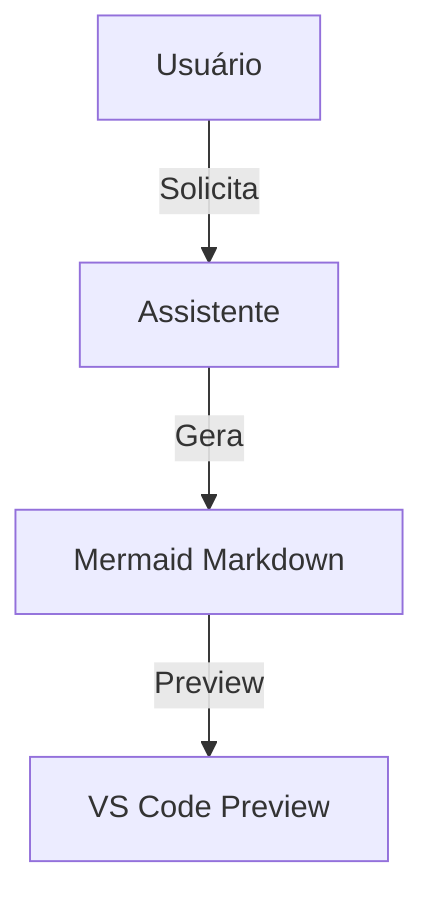

## Mermaid DO and DON'T

- **DON'T** use parentheses or special characters on graph titles or node labels
- **DO** be brief on graph boxes; brevity trumps precision
- **DON'T** rewrite a block if the flow points to an existing block; simply point to it
- **DO** name arrows with actions other than natural flow, preferindo verbos para indicar ação

8. Antes de finalizar, valide o diagrama no site https://mermaid.live/ para garantir que o markdown Mermaid gerado está correto e renderizável.

# Infograph Prompt

Crie um sistema automatizado para transformar conversas em gráficos visualizáveis no VS Code usando markdown e Mermaid. Siga as instruções abaixo:

1. Sempre que o usuário solicitar um gráfico (infograph), analise a conversa atual e extraia entidades, relações e tópicos relevantes.
2. Gere um diagrama Mermaid em markdown, representando visualmente a estrutura, relações ou fluxo discutido.
3. Apague todo o conteúdo anterior de infograph.md.
4. Crie o gráfico usando apenas sintaxe padrão do Mermaid (sem contexto, título ou texto extra).
5. Execute o comando abaixo no terminal para abrir o arquivo automaticamente no VS Code:
   code /Users/nfrota/Documents/nonlinear/internal/code/infograph.md
6. Ative a extensão de preview automático de markdown para exibir o gráfico instantaneamente.
7. Não utilize SVG, PNG ou ferramentas externas — apenas markdown + Mermaid.
8. Os gráficos devem ser simples, legíveis e focados no essencial da conversa.
9. Se não houver contexto suficiente para um gráfico, explique o que está faltando.

**Exemplo de resposta:**

````
# Infograph



```
