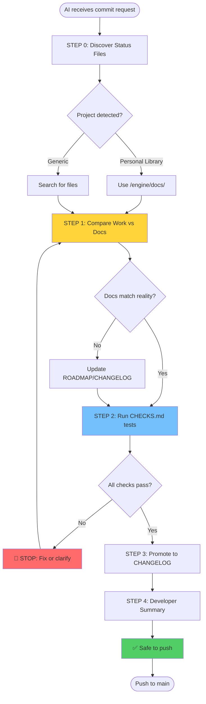

# Project Status Check: What's Up?

**Purpose:** Universal pre-commit workflow ensuring documentation-code parity and stability.

**When to use:** Before EVERY commit, especially after long breaks or major changes.

**🚨 CRITICAL RULE:** Never push until ALL checks from CHECKS.md pass. Return to fix or ask for clarification.

---

## 🔄 The Workflow (AI Overview)



**What this means:**

1. **Discover** where status files live (project-specific)
2. **Compare** actual work with documented plans
3. **Validate** stability using CHECKS.md
4. **Update** docs automatically (ROADMAP → CHANGELOG)
5. **Inform** developer what changed and what's next
6. **Block** push if checks fail

---

## 📋 STEP 0: Detect Project & Locate Status Files

**AI: Determine which project you're in:**

### Personal Library Detection

```bash
# Check if this is Personal Library MCP
test -f "scripts/mcp_server_lazy.py" && test -d "books/" && echo "Personal Library MCP"
```

**If Personal Library:**

```markdown
✅ **Project:** Personal Library MCP
**Status Files:** `/engine/docs/`

- ROADMAP: engine/docs/ROADMAP.md
- CHANGELOG: engine/docs/CHANGELOG.md
- CHECKS: engine/docs/CHECKS.md
  **Current version:** (check CHANGELOG.md latest entry)
```

### Generic Project Discovery

```bash
# Search for status files in common locations
find . -maxdepth 3 \( -iname "roadmap.md" -o -iname "changelog.md" -o -iname "checks.md" \) 2>/dev/null
```

**If NOT found:**

- ❌ **STOP:** Ask user "I don't see ROADMAP/CHANGELOG/CHECKS files. Should I create them?"
- ✅ Create from templates (see bottom of this file)
- ✅ Use README.md sections as fallback

---

## 📊 STEP 1: Compare Work vs Documentation

**AI: What actually changed vs what's documented?**

### 1A. Analyze Actual Changes

```bash
# What files changed?
git diff --name-status

# What code changed?
git diff --stat

# What commits since last release?
LAST_VERSION=$(grep -m1 "^## v" CHANGELOG.md | cut -d' ' -f2)
git log --oneline "${LAST_VERSION}..HEAD"
```

**Categorize changes:**

- [ ] Bug fixes only → Patch version (v0.2.0 → v0.2.1)
- [ ] New features, backward compatible → Minor version (v0.2.x → v0.3.0)
- [ ] Breaking changes → Major version (v0.x → v1.0)

### 1B. Check ROADMAP.md

**AI: Read ROADMAP.md and find matching features:**

```bash
# For Personal Library:
cat engine/docs/ROADMAP.md | grep "🔶 (IN PROGRESS)" -A 20

# Generic:
cat ROADMAP.md | grep -i "in progress\|pending\|todo" -A 20
```

**Questions to answer:**

- [ ] Did we complete a ROADMAP feature?
- [ ] Did we work on something NOT in ROADMAP? (document it)
- [ ] Are ROADMAP checkboxes accurate? (update them)

### 1C. Match Reality to Plans

**AI: Create comparison report:**

```markdown
## Work vs Documentation Analysis

**What I found in git:**

- Changed files: [list]
- Type of change: [patch/minor/major]
- Estimated scope: [1 feature / multiple / refactor]

**What ROADMAP says:**

- Listed as: [version section, e.g., "v0.3: Delta Indexing"]
- Status: [IN PROGRESS / PLANNED / not mentioned]
- Checkboxes: [X done / Y pending]

**Match?**

- ✅ YES: ROADMAP accurately reflects what we did
- ❌ NO: Need to update [ROADMAP/CHANGELOG]
  - Action: [move to CHANGELOG / update checkboxes / add new section]
```

---

## 🧪 STEP 2: Run Stability Checks (MANDATORY)

**🚨 CRITICAL:** Do NOT proceed to STEP 3 unless ALL checks pass.

### 2A. Locate CHECKS.md

**AI: Find and read CHECKS.md:**

```bash
# Personal Library
cat engine/docs/CHECKS.md

# Generic
find . -iname "checks.md" -o -iname "stability.md" -o -iname "testing.md"
```

**If NOT found:**

- ❌ **STOP:** "I don't see CHECKS.md. What tests must pass before pushing?"
- ✅ Create CHECKS.md from user input
- ✅ Use generic tests as template

### 2B. Execute Tests

**For Personal Library MCP, run:**

```bash
# Test 1: MCP server startup
timeout 3 python3.11 scripts/mcp_server_lazy.py 2>&1 | grep -q "ready"
echo "Server startup: $?"

# Test 2: Dependencies
python3.11 -c "import llama_index.core; import sentence_transformers"
echo "Dependencies: $?"

# Test 3: File structure
test -f books/metadata.json && test -d models/ && test -d storage/
echo "File structure: $?"

# Test 4: Query works (if scripts/query.py exists)
python3.11 scripts/query.py "test" > /dev/null 2>&1
echo "Query: $?"
```

**For generic projects:**

- Follow CHECKS.md if exists
- Otherwise ask: "What's the main command to test this works?"

### 2C. Validation Gate

**AI: Report results:**

```markdown
## Stability Check Results

| Test        | Status | Output         |
| ----------- | ------ | -------------- |
| [Test name] | ✅/❌  | [brief result] |
| [Test name] | ✅/❌  | [brief result] |

**Overall:** [✅ ALL PASS / ❌ X FAILURES]
```

**Decision tree:**

- ✅ **All pass:** Proceed to STEP 3
- ❌ **Any fail:**

  ```
  🛑 STOP: Cannot push until checks pass.

  Failed: [test names]

  Options:
  1. Fix the issue and re-run checks
  2. Ask me to clarify the requirement
  3. Document as known issue (add to ROADMAP)

  What would you like to do?
  ```

---

## ✏️ STEP 3: Update Documentation

**AI: Automatically update status files based on STEP 1 analysis**

### 3A. Update ROADMAP.md

**If feature completed:**

```markdown
# Before (in ROADMAP.md):

## v0.3: Delta Indexing 🔶 (IN PROGRESS)

- [x] Topic-partitioned storage
- [ ] Automated change detection ← THIS WAS DONE

# After (AI updates):

## v0.3: Delta Indexing 🔶 (IN PROGRESS)

- [x] Topic-partitioned storage
- [x] Automated change detection ← MARKED COMPLETE
```

**If version fully complete:**

- Move entire section from ROADMAP.md to CHANGELOG.md
- Update status: 🔶 (IN PROGRESS) → ✅ (COMPLETED)
- Add completion date

### 3B. Update CHANGELOG.md

**AI: Add new entry following project format:**

```markdown
## v0.3: Delta Indexing ✅ (Jan 19, 2026)

**👥 Who needs to know:**

- Users with large libraries who reindex frequently

**📦 What's new:**

- [x] Automated change detection (scripts/update_delta.py)
- [x] Compare filesystem vs metadata.json
- [x] Incremental reindexing (23× faster)

**Impact:** Only changed books reindex, saves time

**🔧 Migration:** None (backward compatible)
```

### 3C. Version Bumping

**AI: Determine next version:**

```bash
# Get current version from CHANGELOG
CURRENT=$(grep -m1 "^## v" CHANGELOG.md | sed 's/^## v//' | cut -d':' -f1)

# Based on STEP 1 categorization:
# Patch: v0.2.0 → v0.2.1
# Minor: v0.2.1 → v0.3.0
# Major: v0.9.0 → v1.0.0
```

**Update version references:**

- [ ] CHANGELOG.md (add new entry)
- [ ] package.json / setup.py / Cargo.toml (if exists)
- [ ] README.md (if version mentioned)

---

## 👤 STEP 4: Developer Context Summary

**AI: Generate summary for the developer**

### What We Did & When

```bash
# Time analysis
LAST_COMMIT_DATE=$(git log -1 --format="%ai")
TIME_AGO=$(git log -1 --format="%ar")

# Change summary
COMMITS_SINCE=$(git log --oneline CHANGELOG_LAST_VERSION..HEAD | wc -l)
FILES_CHANGED=$(git diff --name-only CHANGELOG_LAST_VERSION..HEAD | wc -l)
```

**AI: Present this to user:**

```markdown
## 📊 Developer Context

**When:** Last worked on this ${TIME_AGO} (${LAST_COMMIT_DATE})

**What:** [Brief description from commit messages]

- Commits: ${COMMITS_SINCE}
- Files changed: ${FILES_CHANGED}
- Version: ${OLD_VERSION} → ${NEW_VERSION}

**Why:** [From ROADMAP/CHANGELOG description]

- Goal: [what we were trying to achieve]
- Result: [what we actually achieved]

**Status:**

- ROADMAP: [X features complete, Y pending in current version]
- Stability: [✅ All checks passed / ❌ X failures]
- Documentation: [✅ Updated / ⚠️ Needs review]

**What's Next:** [From ROADMAP]

1. [Next planned feature]
2. [Or] Ask: "What do you want to work on next?"

**Ready to push?** [✅ YES - all checks passed / ❌ NO - fix issues first]
```

---

## ✅ STEP 5: Safe to Push (Decision Point)

**AI: Final checklist before push:**

```markdown
## Pre-Push Validation

- [x] STEP 0: Status files located
- [x] STEP 1: Work matches documentation
- [x] STEP 2: ALL stability checks passed ← MANDATORY
- [x] STEP 3: Documentation updated
- [x] STEP 4: Developer informed

🚦 **Status:** SAFE TO PUSH

**Commit message template:**
```

[type]: [short summary]

Version: ${OLD_VERSION} → ${NEW_VERSION}
Completed: [feature from ROADMAP]
Checks: ✅ All passed
Updated: ROADMAP.md, CHANGELOG.md

[Detailed description]

```

```

**If ANY checkbox is ❌:**

```
🛑 CANNOT PUSH

Issues:
- [List unchecked items]

Resolve these first, then re-run whatsup.prompt.md
```

---

## 🎯 Quick Reference: Three Audiences

### 1. 👤 Developer (You)

**Gets from STEP 4:**

- When: "Last worked 2 months ago"
- What: "Completed delta indexing feature"
- Why: "To avoid reindexing entire library"
- Next: "v0.4 Provider Integration OR..."

### 2. 👥 Users

**Gets from CHANGELOG.md:**

- What's new: "Delta indexing - 23× faster"
- Who cares: "Large library users"
- Migration: "None - backward compatible"

### 3. 🤖 AI Assistant

**Gets from all files:**

- Code state: [from CHECKS.md tests]
- Planned work: [from ROADMAP.md]
- Completed work: [from CHANGELOG.md]
- Truth source: [documentation matches code]

---

## 🏗️ Project-Specific: Personal Library MCP

- [ ] **Installation steps** - can new user follow them?
  ```bash
  # Test in fresh environment (Docker/VM/new clone)
  git clone [repo] test-install
  cd test-install
  # Follow README steps exactly
  # Does it work? Y/N
  ```
- [ ] **Usage examples** - do they run without modification?
- [ ] **Configuration** - all options documented?
- [ ] **Troubleshooting** - covers current issues?
- [ ] **Version number** - matches actual version?

#### CHANGELOG.md / Release Notes

- [ ] Latest changes documented?
- [ ] Breaking changes highlighted?
- [ ] Migration steps provided?
- [ ] Contributors credited?

#### Inline Documentation

```bash
# Check for outdated comments
grep -r "DEPRECATED\|OBSOLETE\|OLD" . --exclude-dir=.git

# Check for placeholder docs
grep -r "TODO.*doc\|FIXME.*doc" . --exclude-dir=.git
```

- [ ] Function docstrings match actual behavior
- [ ] No placeholder/lorem ipsum text
- [ ] Commented-out code explained or removed

#### Configuration Files

- [ ] README mentions all config files
- [ ] Example configs provided (.env-template, config.example.json)
- [ ] Default values documented
- [ ] Required vs optional fields clear

**AI Assistant Validation:**

> "Read [README.md], then test the Quick Start section step-by-step. Report any discrepancies."

---

## 🔄 PART 4: Upgrade Path (For Users Jumping Versions)

### Version Migration Strategy

**Document breaking changes:**

````markdown
## Migration Guide: v{OLD} → v{NEW}

### Breaking Changes

1. **[Feature/API Changed]**
   - **What changed:** [description]
   - **Why:** [rationale]
   - **Migration:**

     ```bash
     # Old way:
     [old command/code]

     # New way:
     [new command/code]
     ```

### Deprecated (will be removed in v{NEXT})

- `[old_function]` - use `[new_function]` instead
- `[old_config]` - now `[new_config]`

### New Requirements

- [Dependency] v{VERSION}+ now required
- [API Key] now needed for [feature]

### Data Migration

```bash
# If database/storage format changed:
[migration script command]
```
````

### Testing Your Migration

```bash
# Validate upgrade succeeded:
[test commands]
# Expected output: [description]
```

````

**Version Jump Detection:**
```bash
# Create version marker file
echo "{VERSION}" > .version

# On upgrade, compare:
LAST_VERSION=$(cat .version 2>/dev/null || echo "unknown")
CURRENT_VERSION="v1.2.3"  # from code/package.json

if [ "$LAST_VERSION" != "$CURRENT_VERSION" ]; then
  echo "Upgrade detected: $LAST_VERSION → $CURRENT_VERSION"
  echo "See MIGRATIONS.md for upgrade guide"
fi
````

---

## 🗂️ PART 5: File Hygiene

### Code Organization

```bash
# Check for common issues:

# 1. Dead code
find . -name "*.backup" -o -name "*.old" -o -name "*_OLD*"

# 2. Debug artifacts
grep -r "console.log\|print(\|debugger" . --exclude-dir=node_modules

# 3. Hardcoded secrets
grep -r "password.*=.*[\"']\|api.*key.*=.*[\"']\|token.*=.*[\"']" . --exclude-dir=.git

# 4. Absolute paths
grep -r "/Users/\|C:\\Users\|/home/" . --exclude-dir=.git
```

- [ ] No backup/old files (move to deprecated/ or delete)
- [ ] No debug statements (or gated behind DEBUG flag)
- [ ] No secrets in code (use .env)
- [ ] No hardcoded paths (use relative or env vars)

### Dependency Hygiene

```bash
# Python example:
pipreqs . --force  # Generate requirements from imports
diff requirements.txt requirements-generated.txt

# Node example:
npx depcheck  # Find unused dependencies
```

- [ ] requirements.txt / package.json matches actual imports
- [ ] No unused dependencies
- [ ] Version pins justified (major versions OK, patch versions overkill)
- [ ] Security updates applied

### Git Hygiene

- [ ] .gitignore covers secrets (.env, \*.key, etc.)
- [ ] .gitignore covers build artifacts
- [ ] .gitignore covers IDE files (.vscode/settings.json if personal)
- [ ] No large binary files (use Git LFS or external storage)

---

## 📋 PART 6: Pre-Commit Command Sequence

**Run this EVERY time before pushing:**

```bash
#!/bin/bash
# Save as: scripts/pre-push-check.sh

set -e  # Exit on error

echo "🔍 Pre-Push Checklist"
echo "===================="

# 1. Current State
echo "📍 1. Current state:"
git status --short
echo ""

# 2. Stability Test
echo "🧪 2. Testing stability..."
# CUSTOMIZE THIS:
# python main.py --test
# npm test
# make test
echo "✅ Tests passed (or CUSTOMIZE THIS SECTION)"
echo ""

# 3. Documentation Check
echo "📚 3. Documentation parity..."
# Check version consistency
VERSION_CODE=$(grep "version" setup.py | cut -d'"' -f2)  # Adapt to your project
VERSION_README=$(grep "Version:" README.md | cut -d' ' -f2)
if [ "$VERSION_CODE" != "$VERSION_README" ]; then
  echo "❌ Version mismatch: code=$VERSION_CODE, README=$VERSION_README"
  exit 1
fi
echo "✅ Versions match: $VERSION_CODE"
echo ""

# 4. File Hygiene
echo "🗂️ 4. File hygiene..."
TODO_COUNT=$(grep -r "TODO\|FIXME" . --exclude-dir=.git | wc -l)
echo "📝 Found $TODO_COUNT TODOs (document in ROADMAP.md)"
echo ""

# 5. Ready to commit
echo "✅ All checks passed!"
echo ""
read -p "Commit message: " MESSAGE
git add .
git commit -m "$MESSAGE"
echo ""
echo "🚀 Ready to push? (Ctrl+C to abort)"
read -p "Press Enter to push..."
git push
```

**Make it executable:**

```bash
chmod +x scripts/pre-push-check.sh
```

---

## 🎯 PART 7: The Three-Audience Commit Message

**Format:**

```markdown
[type]: [short summary]

## For Developer (Context)

- State before: [was broken/working/experimental]
- What changed: [specific changes]
- State after: [working/needs testing]
- Next steps: [what to do next]

## For Users (Stability)

- Breaking changes: [Y/N - if Y, list them]
- Migration needed: [Y/N - if Y, see MIGRATIONS.md]
- Testing done: [manual/automated/none]
- Known issues: [list or "none"]

## For AI (Docs)

- Updated files: [list]
- Doc-code parity: [✅/❌]
- New dependencies: [list or "none"]
- Deprecated: [list or "none"]
```

**Example:**

```markdown
refactor: migrate from FAISS to LlamaIndex

## For Developer (Context)

- State before: working but slow (4s startup)
- What changed: replaced FAISS with LlamaIndex native vector store
- State after: working, faster (<0.5s startup)
- Next steps: reindex all books, measure performance

## For Users (Stability)

- Breaking changes: YES - requires reindexing
- Migration needed: YES - run `python scripts/reindex_all.py`
- Testing done: manual testing with 3 sample books
- Known issues: none

## For AI (Docs)

- Updated files: README.md, setup.sh, requirements.txt
- Doc-code parity: ✅ (benchmarks updated)
- New dependencies: llama-index-core, llama-index-embeddings-gemini
- Deprecated: sentence-transformers, faiss-cpu
```

---

## 🚨 Red Flags Checklist

**DO NOT PUSH if:**

- ❌ Main functionality is broken
- ❌ You're not sure what changed since last commit
- ❌ README instructions don't work
- ❌ There are uncommitted secrets (.env in git)
- ❌ Breaking changes aren't documented
- ❌ You haven't tested it yourself

**Safe to push if:**

- ✅ All tests pass (or you don't have tests yet - that's OK for hobby projects)
- ✅ README is accurate
- ✅ You can explain what changed in one sentence
- ✅ Known issues are documented
- ✅ Future-you will understand what current-you did

---

## 💡 Project-Specific Customization

**To adapt this for YOUR project:**

1. **Copy this file:** `.github/prompts/whatsup-[PROJECT].prompt.md`
2. **Customize PART 2 (Stability):** Replace example test commands
3. **Customize PART 6 (Pre-commit):** Update `pre-push-check.sh` script
4. **Add to .github/copilot-instructions.md:**

   ```markdown
   ## Pre-Commit

   Always follow `.github/prompts/whatsup-[PROJECT].prompt.md` before pushing.
   ```

**Examples of customization:**

### Python Project

```bash
# PART 2: Stability Test
python -m pytest tests/
python main.py --dry-run
python -m mypy src/
```

### Node.js Project

```bash
# PART 2: Stability Test
npm run build
npm run test
npm run lint
```

### Docker Project

```bash
# PART 2: Stability Test
docker-compose build
docker-compose up -d
docker-compose exec app health-check
docker-compose down
```

---

## 📖 Quick Reference Card

**Print this and tape to your monitor:**

```
┌─────────────────────────────────────┐
│  BEFORE EVERY COMMIT:               │
├─────────────────────────────────────┤
│  1. Does it run? Test it.           │
│  2. Does README match? Read it.     │
│  3. What changed? Document it.      │
│  4. Who's affected? Warn them.      │
│  5. Can AI help next time? Update.  │
└─────────────────────────────────────┘

┌─────────────────────────────────────┐
│  RED FLAGS:                         │
├─────────────────────────────────────┤
│  • "I think it works" = NOT TESTED  │
│  • "Users will figure it out" = BAD │
│  • "I'll document later" = NEVER    │
│  • "Quick fix" = TECHNICAL DEBT     │
└─────────────────────────────────────┘

┌─────────────────────────────────────┐
│  HOBBY PROJECT EXCEPTION:           │
├─────────────────────────────────────┤
│  It's OK to push broken code IF:    │
│  • Clearly marked as WIP in commit  │
│  • Documented in README (⚠️ WIP)    │
│  • On feature branch, not main      │
│  • Known issues listed              │
└─────────────────────────────────────┘
```

---

## 🎓 Philosophy

**Why this matters:**

1. **For Developer:** Future-you has amnesia. Help them.
2. **For Users:** Trust is earned through reliability.
3. **For AI:** Garbage docs → garbage assistance.

**The Golden Rule:**

> "Would I be angry if someone pushed this state to a project I depend on?"

If YES → don't push.
If NO → you're good.

**Remember:**

- Hobby projects are learning projects
- Perfect is the enemy of done
- But "done" should mean "documented and working"
- Not "it compiles on my machine maybe"

---

## 📅 Maintenance

**This prompt should be reviewed:**

- After major changes to project structure
- When onboarding new contributors
- Every 6 months (hobby projects evolve)

**Update this prompt if:**

- You find yourself skipping a section (remove it or make it optional)
- You keep adding manual checks (automate them in CHECKS.md)
- Users report issues this would've caught (add check)
- File locations change (update STEP 0 discovery)

---

## 🏆 Flagship Example: Personal Library MCP

**This project uses the full status file system. Use as reference:**

### File Structure

```
/personal library/
├── README.md                          # Entry point
├── .github/
│   └── prompts/
│       └── whatsup.prompt.md          # This file
└── engine/
    └── docs/
        ├── ROADMAP.md                 # Planned features
        ├── CHANGELOG.md               # Version history
        └── CHECKS.md                  # Stability requirements
```

### Navigation Menu (used in all status files)

```markdown
**📋 Project Status Files:**

- [README](../../README.md) - Entry point & quick start
- [ROADMAP](ROADMAP.md) - Planned features & in-progress work
- [CHANGELOG](CHANGELOG.md) - Completed features & version history
- [CHECKS](CHECKS.md) - Stability requirements & testing
```

### Semantic Versioning Strategy

**Patch (v0.2.0 → v0.2.1):**

- Bug fixes only
- No breaking changes
- No reindexing required
- Users can upgrade without action

**Minor (v0.2.x → v0.3.0):**

- New features
- Backward compatible
- Optional reindexing (if quality improvement)
- Migration guide in CHANGELOG if needed

**Major (v0.x → v1.0):**

- Breaking changes
- Requires full reindexing
- Migration guide REQUIRED in CHANGELOG
- Clear upgrade path for version jumpers

### AI Integration

**In copilot-instructions.md:**

```markdown
## Pre-Commit Workflow

Before any commit, follow: `.github/prompts/whatsup.prompt.md`

**Status Files Location:** `/engine/docs/`

- ROADMAP.md - Check before starting work
- CHANGELOG.md - Update after completing features
- CHECKS.md - Run before every push
```

### Example: Creating Status Files for New Project

**AI workflow:**

1. Check STEP 0: "I don't see ROADMAP.md. Should I create it?"
2. Ask discovery questions:
   - "What's your current version?"
   - "What must work before you push?"
   - "What's planned next?"
3. Create files in appropriate location:
   - Root for simple projects
   - `/docs/` for medium projects
   - `/engine/docs/` for complex projects
4. Add navigation menu to all files
5. Update README.md with links
6. Document location in project's copilot-instructions.md

---

**Last updated:** 2026-01-19
**Template version:** 2.0 (project-agnostic with discovery)
**Flagship implementation:** Personal Library MCP (`/engine/docs/`)

- When onboarding new contributors
- Every 6 months (hobby projects get stale)

**Update this file if:**

- You find yourself skipping a section (remove it)
- You keep adding manual checks (automate them)
- Users report issues this would've caught (add check)

**Last updated:** 2026-01-19
**Template version:** 1.0
**Applies to:** All projects in personal library ecosystem
