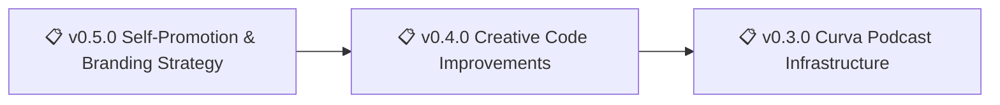

[nonlinear.nyc](https://nonlinear.nyc) is a personal site for Nicholas Frota, built with [Hugo](https://gohugo.io/) for knowledge management, creative coding experiments, and digital publishing. It serves as a content-first platform for notes, illustrations, podcasts, and interactive web features, with a modular structure for rapid prototyping and documentation.

> 🤖
> | Backstage files | Description |
> | ---------------------------------------------------------------------------- | ------------------ |
> | [README](README.md) | Our project |
> | [CHANGELOG](backstage/CHANGELOG.md) | What we did |
> | [ROADMAP](backstage/ROADMAP.md) | What we wanna do |
> | POLICY: [project](backstage/POLICY.md), [global](backstage/global/POLICY.md) | How we go about it |
> | HEALTH: [project](backstage/HEALTH.md), [global](backstage/global/HEALTH.md) | What we accept |
>
> We use **[backstage protocol](https://github.com/nonlinear/backstage)**, v0.3.5
> 🤖

