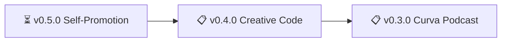

# nonlinear.nyc CHANGELOG

*What we did — shipped features, bug fixes, maintenance.*

> 🤖
>
> - [README](../README.md) - Our project
> - [CHANGELOG](CHANGELOG.md) — What we did
> - [ROADMAP](ROADMAP.md) — What we wanna do
> - [HEALTH](HEALTH.md) — What we accept
>
> 🤖

---

## December 2025

### ✅ v0.2.0 - Site Cleanup & Automation

**Shipped:** 2025-12-07

**What we accomplished:**
- Restored nonlinear.nyc domain from previous deployment issues
- Deduplicated image and asset files across the codebase
- Added Python automation scripts for syncing comics, settings, and posting illustrations
- Fixed CNAME configuration for GitHub Pages custom domain
- Reduced experimental features to focus on core functionality
- Created redirect system for legacy URLs (dudes → drawings-1)

**Technical improvements:**
- Dedupe scripts for images and assets
- Python automation suite (comics sync, settings, new post creation)
- CNAME restoration workflow
- Redirect layout implementation (`layouts/redirect/single.html`)

**Commits:**
- 🔧 [CNAME](https://github.com/nonlinear/nonlinear.github.io/commit/d55510f2): Domain configuration
- 🔧 [dude as redirect](https://github.com/nonlinear/nonlinear.github.io/commit/52a73f91): Legacy URL handling
- 🎨 [less experiments](https://github.com/nonlinear/nonlinear.github.io/commit/903c149d): Focus on core features
- 🎨 [cryboy](https://github.com/nonlinear/nonlinear.github.io/commit/65a8878b): New SVG experiment assets
- 🎨 [feat: add Python automation scripts](https://github.com/nonlinear/nonlinear.github.io/commit/743ef03f): Automation suite
- 🔧 [fix: restore CNAME](https://github.com/nonlinear/nonlinear.github.io/commit/9b93bbc5): Domain fix
- 🔧 [dedupe files](https://github.com/nonlinear/nonlinear.github.io/commit/96595896): Asset cleanup
- 🔧 [dedupe](https://github.com/nonlinear/nonlinear.github.io/commit/e1f4bd9c): Image deduplication
- 🔧 [remove removed](https://github.com/nonlinear/nonlinear.github.io/commit/f892ee2c): Deprecated content cleanup
- 🔧 [fix: restore nonlinear.nyc domain](https://github.com/nonlinear/nonlinear.github.io/commit/1f363676): Main domain restoration

---

### ✅ v0.1.0 - Hugo Layout & JS Refactor

**Shipped:** 2025-12-04

**What we accomplished:**
- Consolidated layouts (merged illos into default)
- Refactored JavaScript loading logic (slug/type-based)
- Created `latestpost` Hugo shortcode with redirect filtering
- Improved RSS feed logic for multiple content types
- Added og:image defaults for illustration posts
- Fixed speeddial interface logic and styles

**Technical improvements:**
- `layouts/shortcodes/latestpost.html` - Latest post widget
- `layouts/partials/load-js.html` - Dynamic JS loader
- `layouts/redirect/single.html` - Meta-refresh redirect template
- RSS templates for main feed and Curva podcast
- Cover image selection logic in head partial
- Speeddial refactor (SCSS, HTML, JS)

**Commits:**
- 🔧 [latestpost Hugo shortcode](https://github.com/nonlinear/nonlinear.github.io/commit/DEC2025): Latest post widget
- 🎨 [cleaning up speeddial](https://github.com/nonlinear/nonlinear.github.io/commit/0f67835): Speeddial refactor
- 🎨 [consolidating layouts](https://github.com/nonlinear/nonlinear.github.io/commit/48d44f1): Layout merge
- 📄 [readme](https://github.com/nonlinear/nonlinear.github.io/commit/9812dfb): Documentation update
- 🎨 [js from slug or type](https://github.com/nonlinear/nonlinear.github.io/commit/a2f567d): JS loader refactor
- 📄 [redoing jsLib and jsScript](https://github.com/nonlinear/nonlinear.github.io/commit/17d5165): JS system redesign
- 🐞 [rss feeds](https://github.com/nonlinear/nonlinear.github.io/commit/02c0970): RSS improvements
- 🎨 [cover conditions](https://github.com/nonlinear/nonlinear.github.io/commit/344932b): Cover image logic
- 🎨 [illos og:image default](https://github.com/nonlinear/nonlinear.github.io/commit/523d1ef): Social media defaults
- 🐞 [rss feed fix](https://github.com/nonlinear/nonlinear.github.io/commit/a870824): RSS format fix
- 📄 [image priority comment](https://github.com/nonlinear/nonlinear.github.io/commit/d201d0a): Documentation

---

*Last updated: 2026-02-04*
