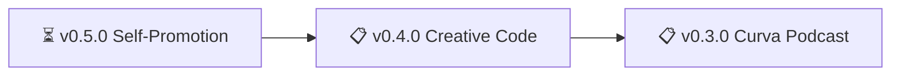

# nonlinear ROADMAP

> 🤖
> | Backstage files | Description |
> | ---------------------------------------------------------------------------- | ------------------ |
> | [README](../README.md) | Our project |
> | [CHANGELOG](CHANGELOG.md) | What we did |
> | [ROADMAP](ROADMAP.md) | What we wanna do |
> | POLICY: [project](POLICY.md), [global](global/POLICY.md) | How we go about it |
> | HEALTH: [project](HEALTH.md), [global](global/HEALTH.md) | What we accept |
>
> We use **[backstage protocol](https://github.com/nonlinear/backstage)**, v0.3.5
> 🤖

---

## v0.5.0

### Self-Promotion & Branding Strategy

**Status:** ⏳ Planned

**Problem:** Personal brand needs cohesive strategy across platforms

**Solution:** Research-driven branding using OpenClaw research prompt

**Tasks:**
- [ ] Research current presence (site, GitHub, social)
- [ ] Define positioning & audience
- [ ] Platform-specific strategies
- [ ] Content calendar framework
- [ ] Quick wins (bio updates, featured content)

**Details:** [epic-notes/v0.5.0-self-promotion.md](epic-notes/v0.5.0-self-promotion.md)

---

## v0.4.0

### Creative Code Improvements

**Problem:** Site interactions need better UX hints and missing features

**Solution:** Add user nudges, mailing list integration, content cleanup

**Tasks:**
- [ ] Warning/nudge logic (hover/click for more, dependencies expected, etc)
- [ ] Mailing list integration (Email Octopus)
- [ ] Add titles to posts missing frontmatter `title:` (see: `content/dudes.md`, `content/sketches-1.html`, `content/latest.html`)
- [ ] Nudge "hover for stopmotion" on illos

---

## v0.3.0

### Curva Podcast Infrastructure

**Status:** ⏳ Paused

**Problem:** Podcast needs recording tools and hosting infrastructure

**Solution:** Set up recording workflow and cloud storage for audio files

**Tasks:**
- [ ] Find screenflow equivalent (screen recording)
- [ ] Review curva RSS feed
- [x] Find zencastr or similar (remote recording)
- [ ] AWS for audio files (hosting)
- [x] Test curva filter

---

## 🏗️ Site Maintenance

- Hugo static site generator
- Content: notes, illustrations, podcasts, experiments
- GitHub Pages publishing
- Media sync automation

---

## 📚 Content Areas

- Curva podcast
- Drawings & illustrations
- Creative coding experiments
- Knowledge management notes
- Digital publishing

---

*Last updated: 2026-02-04*
