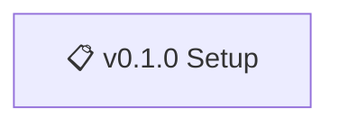

# Nonlinear - Roadmap

> 🤖
> This project follows [backstage protocol](https://github.com/nonlinear/backstage) v0.3.4
>
> - [README](../README.md) 👏 [ROADMAP](ROADMAP.md) 👏 [CHANGELOG](CHANGELOG.md) 👏 checks: [local](checks/local/) 4, [global](checks/global/) 0
>
> 🤖

---

## v0.1.0

### Setup

**Goal:** Project infrastructure ready

**Tasks:**

- [ ] Define project scope
- [ ] Initial documentation

---
