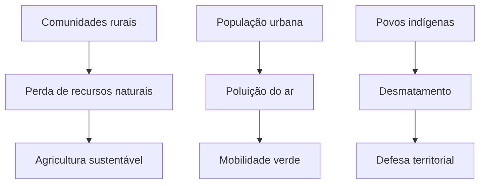

Neste episódio, analisamos como as mudanças ambientais afetam diferentes grupos sociais e discutimos possíveis respostas coletivas.

## Temas discutidos

- Desigualdade ambiental
- Movimentos sociais no Antropoceno
- Estratégias de adaptação

### Tarefas para o ouvinte

- [x] Ouvir o episódio
- [ ] Identificar exemplos de desigualdade ambiental
- [ ] Compartilhar uma experiência pessoal sobre adaptação

#### Tabela de impactos

| Grupo Social         | Impacto Ambiental           | Possível Resposta      |
|----------------------|----------------------------|-----------------------|
| Comunidades rurais   | Perda de recursos naturais | Agricultura sustentável|
| População urbana     | Poluição do ar             | Mobilidade verde      |
| Povos indígenas      | Desmatamento               | Defesa territorial    |

### Impactos sociais do Antropoceno (Exemplo Mermaid)

---

### Fluxo de tarefas do ouvinte (Exemplo Mermaid)

**Resumo:**  
Este episódio explora os impactos sociais do Antropoceno e destaca a importância da ação coletiva para enfrentar desafios ambientais.