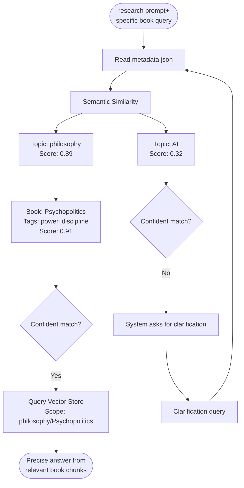

**The Map ≠ Territory principle:** Navigate with metadata first, access content only when direction is clear.

### 2. Delta Updates

No full reindexing: The system watches your book folder and only processes what changed.

**Promise:** When you add a new book, only that book gets processed. When you remove one, only that entry gets deleted. No waiting for full reindexing.

**Promise:** The MCP never explores your vault without explicit instruction. No background scanning, no unsolicited responses, no "smart" auto-discovery.

**Promise:** Instant startup, sub-second queries, no model loading delays.

**Promise:**

- Your book content never leaves your machine
- Only text chunks are embedded via API (no storage on Google's side)
- Works entirely offline after initial embedding
- No vendor lock-in—bring your own books

### What it is

✅ **Latency:** Sub-second query responses
✅ **Privacy:** Local-first, your data stays yours
✅ **Efficiency:** Only indexes what changed
✅ **Clarity:** Asks for clarification when uncertain
✅ **Simplicity:** Single metadata file for navigation

### What it is not

❌ Not a chat interface
❌ Not cloud-dependent
❌ Not a general-purpose MCP
❌ Not trying to be "smart" beyond navigation
❌ No automatic exploration without explicit invocation

[Github repository](https://github.com/nonlinear/personal-library)
