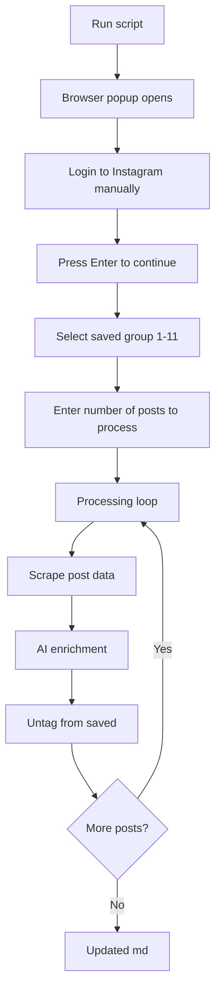

Fully automated workflow that scrapes, enriches, and removes Instagram saved posts in a single run.

- Extract links from your chosen Instagram saved collection
- Add AI-generated titles, language tags, dates, author usernames, and hashtags
- Remove processed posts from Instagram saved (cleanup)

---

[reels_library.py](https://github.com/nonlinear/notes/blob/main/.github/scripts/reels_library.py)

---

## Example Output

After running the script on "interesting history" group:

- [reason Japanese expelled all Westerners in 17th](https://www.instagram.com/p/DS4YY6nEReK/) @the_smart_cookies_pod #en-US #2025-12-30 #interesting-history #japanesehistory #japan #historical #asia
- [Americans worried about every country but their](https://www.instagram.com/p/DSffPF3AJuX/) @lexlos3r #en-US #2025-12-20 #interesting-history #politics
- [Lindener Pareto traça um paralelo histórico da](https://www.instagram.com/p/DSJChIzjJCc/) @icl.noticias #pt-BR #2025-12-11 #interesting-history #noticias #icl #notícias
- [Corporate America repeating familiar mistake](https://www.instagram.com/p/DRdzIPxjDqi/) @maxxrosenblum #en-US #2025-11-25 #interesting-history #economics #ai #business #casestudy

All posts:
✅ Have meaningful titles (AI-generated)
✅ Have author usernames
✅ Have language tags (for semantic search)
✅ Have publication dates
✅ Have all original hashtags
✅ Are removed from Instagram saved
✅ Are ready for AI queries like "find portuguese reels about lula and elections"

---

## Workflow

**Processing time:** ~5-10 seconds per post

---

## Todos

- [ ] Better caption extraction for posts without hashtags
- [ ] Handle reels with multiple languages (currently picks first detected)
- [ ] Batch processing optimization (reduce per-post wait time)
- [ ] Option to skip untag step (scrape + enrich only)
