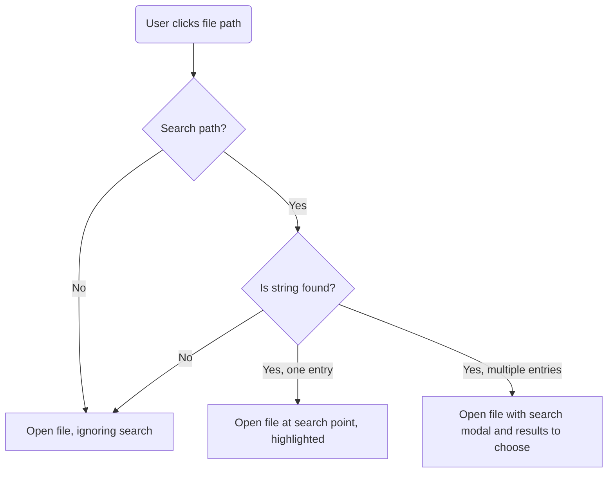

## Description

Extending bare links for EPUB and PDF files to support an auto search, using a format like: `file://FILEPATH.EXT?search="STRING"`

When accessed, this link would automatically perform a search for the given string within the file.

> This allows for more precise AI source lists, especially on EPUBs or other files with no pagination.
