> Whatsup is a **pre-commit workflow system** that ensures your code changes stay synchronized with project documentation. Before any commit, it:

1. **Reads README** → Locates your ROADMAP, CHANGELOG, and CHECKS files
2. **Compares Work** → Git diff analysis against documented features
3. **Runs CHECKS** → Executes all validation scripts (must pass)
4. **Updates Documentation** → Auto-promotes completed features (ROADMAP → CHANGELOG)
5. **Decision Point** → Determines commit readiness with context-aware outcomes

### The Three Audiences

Whatsup serves distinct stakeholders with tailored information:

1. 👷 Developers (You):
   - **When:** Last worked 2 months ago
   - **What:** Completed delta indexing feature
   - **Why:** To avoid reindexing entire library
   - **Next:** v0.4 Provider Integration OR start new work

2. 👥 Users:
   - **What's New:** Delta indexing - 23× faster reindexing
   - **Who Cares:** Large library users
   - **Migration:** None - backward compatible
   - **Impact:** Only changed books reindex, saves time

3. 🤖 AI Assistants:
   - **Code State:** Live test results from CHECKS
   - **Planned Work:** Current ROADMAP items
   - **Completed Work:** Version history from CHANGELOG
   - **Truth Source:** Documentation matches code reality

```mermaid
flowchart TD
    STEP4([STEP 4: Analyze State]) --> CHECK{Checks passed?}

    CHECK -->|No| FAIL[Outcome 1: FAILED CHECKS]
    CHECK -->|Yes| STABLE{Docs match reality?}

    STABLE -->|No| MISMATCH[Outcome 2: DOCS MISMATCH]
    STABLE -->|Yes| PROGRESS{Work done?}

    PROGRESS -->|No changes| GROOM[Outcome 3: GROOMING MODE]
    PROGRESS -->|Partial| PARTIAL[Outcome 4: IN PROGRESS]
    PROGRESS -->|Complete| COMPLETE[Outcome 5: VERSION COMPLETE]

    FAIL --> REPORT1(["<b>NEXT:</b><br>🛑 Explain problem<br/>List failed tests<br/>Suggest fixes"])

    MISMATCH --> REPORT2(["<b>NEXT:</b><br>⚠️ Update docs<br/>Show what changed<br/>Auto-update files"])

    GROOM --> REPORT3(["<b>NEXT:</b><br>🧑 List next options<br/>Show ROADMAP<br/>Ask what's next"])

    PARTIAL --> REPORT4(["<b>NEXT:</b><br>✅ Update checkboxes<br/>Show progress<br/>Push increment"])

    COMPLETE --> REPORT5(["<b>NEXT:</b><br>🎉 Move to CHANGELOG<br/>Announce version<br/>Celebrate!"])

```

[Get whatsup prompt](https://github.com/nonlinear/nonlinear.github.io/blob/main/.github/prompts/whatsup.prompt.md)

---

---

---

## Comparative Analysis

### ✅ What Works Well

1. **README-First Architecture**: Aligns strongly with **established version control principles**. Git's hierarchical configuration (repository → user → system) mirrors whatsup's single-source-of-truth approach, making project navigation less error-prone.

2. **Outcome-Driven Workflow**: Matches **modern product architecture thinking**. The emphasis on walking the tree (README → opportunity → solution → outcome) reflects the continuous discovery habit of connecting outputs to business value, preventing "build trap" scenarios.

3. **5-Step Iterative Process**: Reflects **commit-based accountability principles**. Git's atomic transactions and immutable history philosophy shows up in whatsup's structured checkpoints (`CHECKS` → `ROADMAP` → `CHANGELOG`).

---

### ⚠️ What's Problematic

1. **Missing Conflict Resolution Strategy**: Multi-leader replication systems handle concurrent changes through **automated conflict detection**. Whatsup assumes sequential, single-developer workflows—**no guidance** for when two teammates modify ROADMAP simultaneously or when CHECKS results diverge from local testing.

2. **No Rollback Mechanism**: Git's **immutable history** enables safe reverts. Whatsup's "update CHANGELOG, update ROADMAP" steps lack a **clear undo path** when a commit introduces breaking changes discovered post-merge.

3. **Lacks Branching Strategy**: Version control systems use **branches for experimental work**. Whatsup operates in a single timeline—what happens when you need to test risky changes without affecting the main outcome tracking?

---

### 🔍 What's Missing

1. **Anti-Entropy Verification**: Distributed systems use **automated consistency checks** between replicas. Whatsup relies on manual human judgment in STEP 2A—**no automated cross-validation** that CHECKS pass/fail aligns with ROADMAP promises.

2. **Documentation Replication Streams**: Git uses **WAL shipping and logical logs** to keep distributed copies synchronized. For teams using whatsup across repositories, there's **no guidance** on propagating status file updates or maintaining consistency.

3. **Semantic Versioning Integration**: Conventional commit messages and semantic versioning aren't embedded in the workflow. CHANGELOG updates lack **structured formatting** that tooling could parse for automated dependency management.

4. **Leading vs. Lagging Indicators**: Product outcomes distinguish between what you measure to test assumptions (search starts) vs. what drives business value (hires). Whatsup's CHECKS.md **doesn't differentiate** between stability tests and outcome-impact tests.

5. **Incremental Adoption Path**: Whatsup requires **all-or-nothing commitment**. No guidance for teams migrating from existing workflows gradually—which steps to adopt first? How to run whatsup alongside legacy processes? What's the minimum viable implementation?
