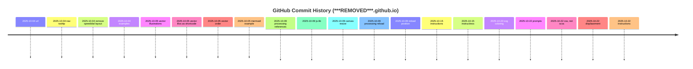
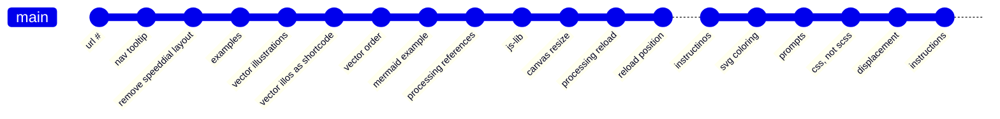
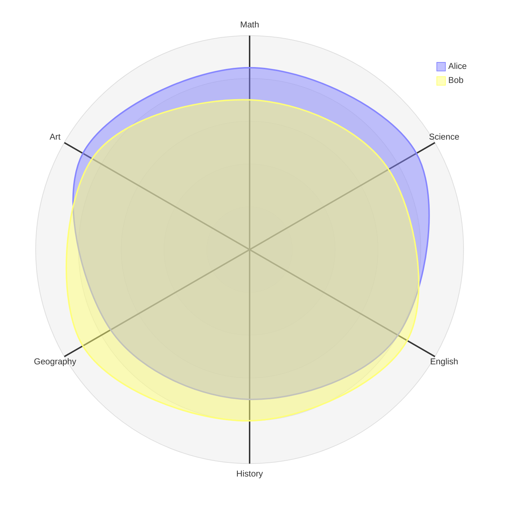

```mermaid
timeline
  title GitHub Commit History (***REMOVED***.github.io)
  2025-10-04 url #
  2025-10-04 nav tooltip
  2025-10-04 remove speeddial layout
  2025-10-04 examples
  2025-10-05 vector illustrations
  2025-10-05 vector illos as shortcode
  2025-10-05 vector order
  2025-10-05 mermaid example
  2025-10-09 processing references
  2025-10-09 js-lib
  2025-10-09 canvas resize
  2025-10-09 processing reload
  2025-10-09 reload position
  2025-10-15 instructions
  2025-10-15 instructinos
  2025-10-20 svg coloring
  2025-10-22 prompts
  2025-10-22 css, not scss
  2025-10-22 displacement
  2025-10-22 instructions
```

```mermaid
gitGraph
   commit id: "url #"
   commit id: "nav tooltip"
   commit id: "remove speeddial layout"
   commit id: "examples"
   commit id: "vector illustrations"
   commit id: "vector illos as shortcode"
   commit id: "vector order"
   commit id: "mermaid example"
   commit id: "processing references"
   commit id: "js-lib"
   commit id: "canvas resize"
   commit id: "processing reload"
   commit id: "reload position"
   commit id: "instructions"
   commit id: "instructinos"
   commit id: "svg coloring"
   commit id: "prompts"
   commit id: "css, not scss"
   commit id: "displacement"
   commit id: "instructions"
```

```mermaid
radar-beta
  axis m["Math"], s["Science"], e["English"]
  axis h["History"], g["Geography"], a["Art"]
  curve a["Alice"]{85, 90, 80, 70, 75, 90}
  curve b["Bob"]{70, 75, 85, 80, 90, 85}

  max 100
  min 0
```
