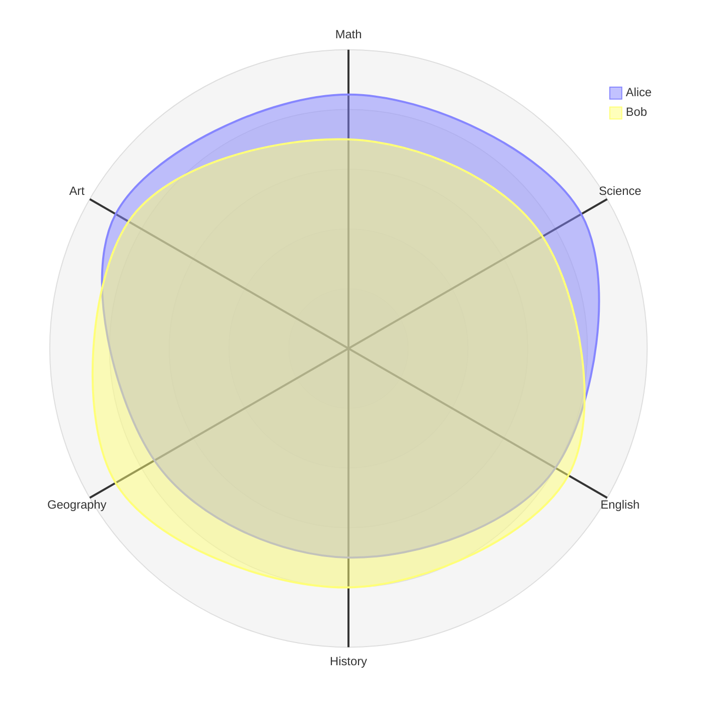
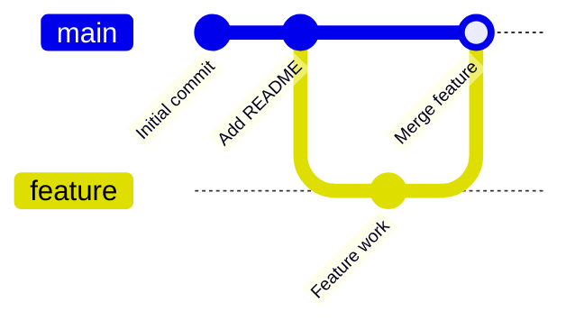

```mermaid
timeline
    title GitHub Commit History (***REMOVED***.github.io)
    2025-10-04T21:09:01 : url #
    2025-10-04T22:29:31 : nav tooltip
    2025-10-04T22:35:23 : remove speeddial layout
    2025-10-04T22:45:50 : examples
    2025-10-05T02:01:49 : vector illustrations
    2025-10-05T02:06:39 : vector illos as shortcode
    2025-10-05T02:18:04 : vector order
    2025-10-05T20:39:10 : mermaid example
    2025-10-09T00:08:18 : processing references
    2025-10-09T00:22:19 : js-lib
    2025-10-09T01:20:12 : canvas resize
    2025-10-09T01:55:45 : processing reload
    2025-10-09T01:59:22 : reload position
    2025-10-15T02:00:28 : instructions
    2025-10-15T02:06:59 : instructinos
    2025-10-20T16:36:14 : svg coloring
    2025-10-22T01:13:47 : prompts
    2025-10-22T01:40:30 : css, not scss
    2025-10-22T02:31:18 : displacement
    2025-10-22T13:51:59 : instructions
```


