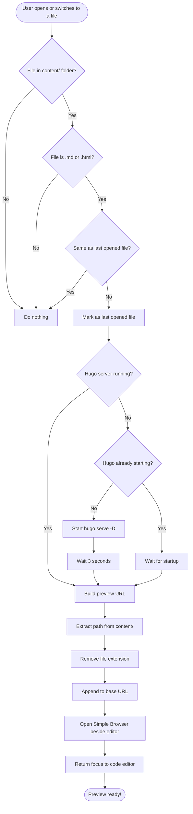

## Installation

```
code --install-extension https://github.com/nonlinear/nonlinear.github.io/raw/main/.vscode/extensions/preview-in-browser/preview-in-browser-latest.vsix
```

or [Download .vsix](https://github.com/nonlinear/nonlinear.github.io/raw/main/.vscode/extensions/preview-in-browser/preview-in-browser-latest.vsix)

## Features

- Detects hugo, runs server
- Opens Simple Browser with corresponding Hugo URL

## Roadmap

- Detects storybook, runs server
- Opens Simple Browser with corresponding storybook URL


