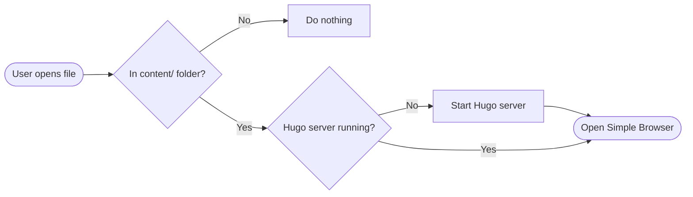
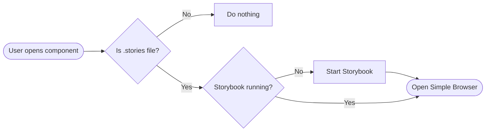

A vscode extension that automatically opens browser page of any HTML or Markdown. Works with Hugo and Storybook.

## Installation

```
code --install-extension https://github.com/nonlinear/nonlinear.github.io/raw/main/.vscode/extensions/preview-in-browser/preview-in-browser-latest.vsix
```

or [Download .vsix](https://github.com/nonlinear/nonlinear.github.io/raw/main/.vscode/extensions/preview-in-browser/preview-in-browser-latest.vsix)

## Hugo flow



## Storybook flow



## Roadmap

- Simple Browser on a separate tab column
- Publish on vscode marketplace?
